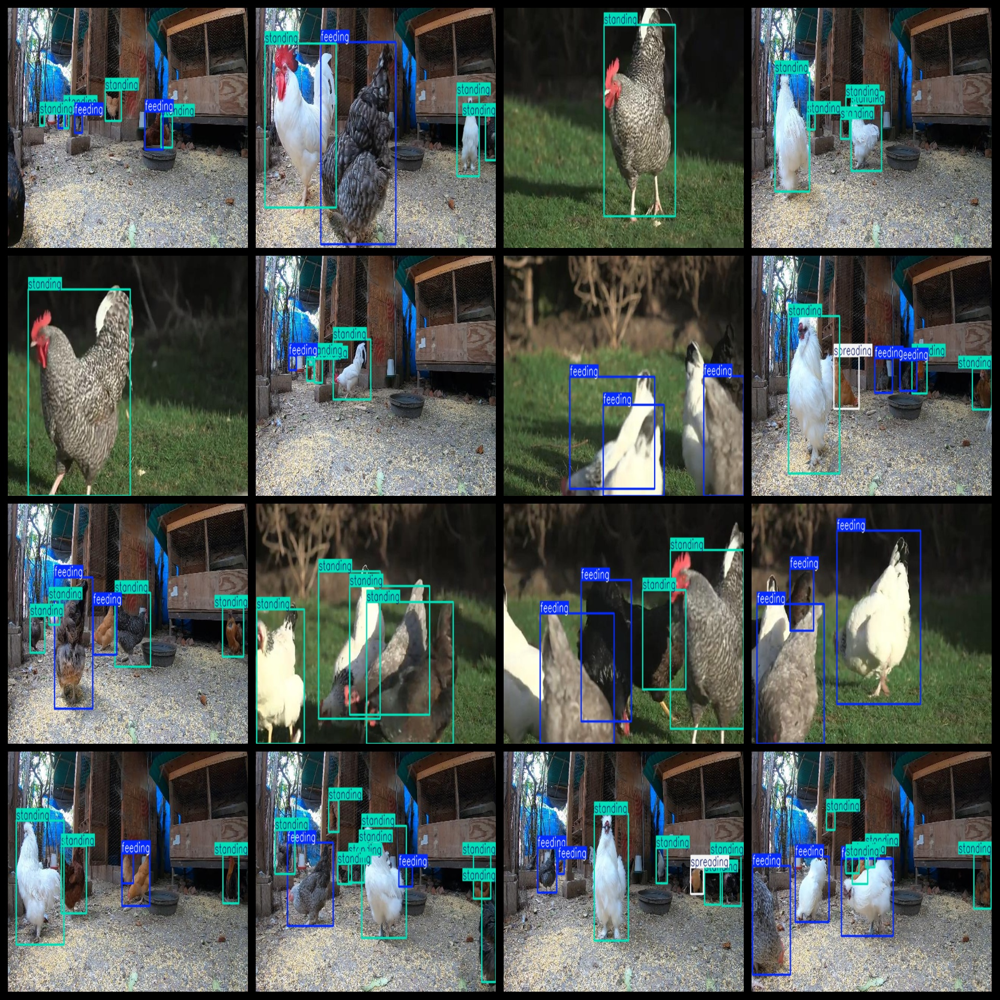
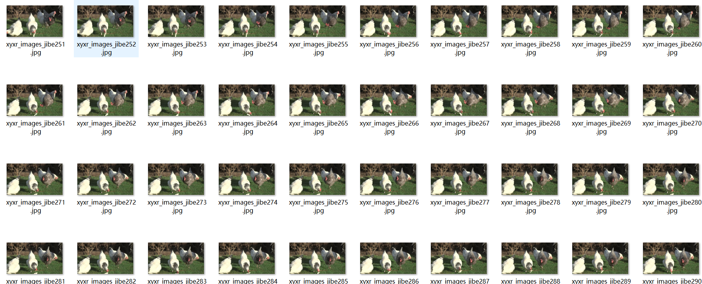

# [Object Detection] Chicken Behavior Detection Dataset 2691 imagesYOLO+VOC format

【Target Detection】Chicken Behavior Detection Dataset with 2691 Images in YOLO+VOC format

Dataset Format: VOC format + YOLO format

The compressed file contains: three folders, each storing images, xml files, and text files.

Total jpg images in JPEGImages folder: 2691

The total number of XML files in the Annotations folder is: 2691.

The total number of txt files in the labels folder is 2691.

Number of tag categories: 4

Tag names: ["feeding","sitting","spreading","standing"]

The number of boxes for each label (Note that the order of labels in the Yolo format does not correspond to this, but is based on the classes.txt file in the labels folder):

feeding frame count = 5063

sitting frame count = 78

spreading frame count = 320

standing frame count = 7885

Total boxes: 13346

Picture clarity (Resolution: Pixels): Clear

Is the image enhanced: No

Shape of the label: Rectangular box, used for object detection and recognition.

Annotation and image details are as follows:

## Images

---

Here is a pay link on Stripe (https://buy.stripe.com/3cs8yP7sY87d0vu9AB). Please contact me lonlonago@foxmail.com after funding $89, and I will send you a complete data files, thank you!

